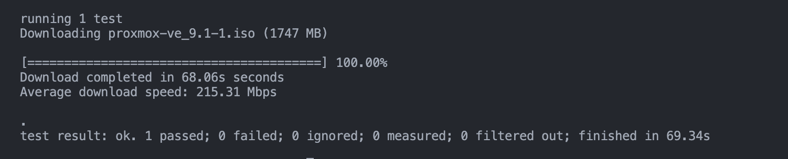

# 0xDL


[](https://crates.io/crates/oxdl)


---

A Rust library for fast, reliable asynchronous file downloading.


0xDL provides a clean, minimal abstraction for downloading large files over HTTP/S using asynchronous Rust.

Built on **Tokio** and **reqwest**, it offers:

- High‑performance async streaming
- Optional progress callbacks
- Optional SHA‑256 verification with guaranteed cleanup on failure
- Atomic final file placement

## Installation

Install 0xDL using Cargo:

```bash
cargo add oxdl
```

Or add it manually to `Cargo.toml`:

```toml
[dependencies]
oxdl = "0.1.2"
```

## Features

- Fully asynchronous file downloads
- Optional `Fn(f32)` progress callbacks
- Optional SHA‑256 integrity verification
- Automatic cleanup of failed downloads
- Atomic final file write

## Screenshot



## Usage

0xDL exposes two high‑level functions.

### 1. `download(url, path, sha256)` — simple download

```rs
use oxdl::download;

#[tokio::main]
async fn main() -> Result<(), oxdl::DownloadError> {
    let url = "https://example.com/file.iso";
    let path = "file.iso";

    download(url, path, None).await?;
    Ok(())
}
```

### 2. `download_with_updates(url, path, progress_callback, sha256)`

```rs
use oxdl::download_with_updates;

#[tokio::main]
async fn main() -> Result<(), oxdl::DownloadError> {
    let url = "https://example.com/file.iso";
    let path = "file.iso";

    let progress = |pct: f32| println!("Progress: {:.1}%", pct);

    download_with_updates(url, path, Some(Box::new(progress)), None).await?;

    Ok(())
}
```

## API Summary

| Function                | Progress   | SHA‑256    | Use Case                           |
| ----------------------- | ---------- | ---------- | ---------------------------------- |
| `download`              | ❌         | ✔ optional | Simple fire‑and‑forget download    |
| `download_with_updates` | ✔ optional | ✔ optional | UI/CLI progress + integrity checks |

> If SHA‑256 validation fails, 0xDL automatically deletes the temporary file.

## Builder API

Advanced users may construct a downloader manually.

### Example

```rs
use oxdl::Downloader;

let dl = Downloader::new("https://example.com/file.iso", "file.iso")?
    .on_update(|p| println!("{p:.1}%"))
    .with_sha256("deadbeef...")?;

dl.execute().await?;
```

### Methods

| Method             | Description                               |
| ------------------ | ----------------------------------------- |
| `new(url, path)`   | Validates and constructs a downloader     |
| `on_update(f)`     | Sets a callback receiving progress 0–100% |
| `with_sha256(hex)` | Enables SHA‑256 verification              |
| `execute()`        | Performs the full download                |

## Supported Platforms

- Rust stable
- Linux, macOS, Windows

## Testing

0xDL organizes tests using features so expensive tests only run when requested.

### Features

| Feature              | Includes                            |
| -------------------- | ----------------------------------- |
| `tests`              | Offline unit tests                  |
| `net-tests`          | Real HTTP downloads                 |
| `dl-iso-test`        | Large (>1GB) ISO stress test        |
| `all-tests`          | tests + net-tests                   |
| `all-tests-w-iso-dl` | everything including large ISO test |

### Running

```bash
cargo test --features net-tests
```

```bash
cargo test --features all-tests
```

```bash
cargo test --features all-tests-w-iso-dl
```

```bash
cargo test --features dl-iso-test -- --nocapture --quiet
```

## License

MIT

## Contributing

PRs welcome.

## Contact

Created by **Anthony Tropeano** — [https://github.com/iitoneloc](https://github.com/iitoneloc)
